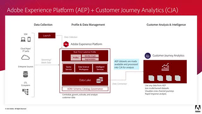

# Självstudiekurser för Customer Journey Analytics

Välkommen till [!DNL Customer Journey Analytics] självstudiekurser - webbplats.  Använd dessa självstudiekurser tillsammans med [dokumentation](https://experienceleague.adobe.com/docs/analytics-platform/using/cja-landing.html) ger er en bättre förståelse för hur ni kan använda Adobe Analytics för att få kundinsikter i flera kanaler snabbare än någonsin.  För att komma igång,

* Se **&quot;What&#39;s New&quot;** nedan för de senaste funktionerna
* **Personalval** markerar en del av vårt favoritinnehåll
* Utforska innehållet efter ämne och ämne i **vänster navigering**
* Använd **sök** fältet längst upp på sidan om du vet vad du letar efter

Med Customer Journey Analytics kan ni styra hur ni kopplar samman online- och offlinedata i Analysis Workspace med vilket kundID som helst, vilket slutligen gör att ni kan skapa attribuering, segmentering, flöde, utfall osv. i hela er kunddatauppsättning.

## Personalval

<table>
<tr>
  <td>
    
    

      <a href="visitor-id/understanding-how-customer-journey-analytics-uses-identity.md">
    <strong>Förstå hur Customer Journey Analytics använder identitet</strong>
    </a>
    

    

    <em>En praktisk bild av hur identiteten påverkar er analys i Customer Journey Analytics</em>
    

  </td>
   <td>
    
    

      <a href="architecture/architecture-and-integrations-of-cja.md">
    <strong>Arkitektur och integrering av Customer Journey Analytics</strong>
    </a>
    

    

    <em>Genomgång av Customer Journey Analytics arkitektur, inklusive integrering med Adobe Experience Platform.</em>
    

  </td>
  <td>
    
    

      <a href="analysis-workspace/visualizations/cross-channel-attribution-in-customer-journey-analytics.md">
    <strong>Flerkanalsattribuering i Customer Journey Analytics</strong>
    </a>
    

    

    <em>Så här kan du använda visualiseringar för att visa attribuering (ge kredit) över olika kanaler.</em>
    

  </td>
</tr>
</table>

