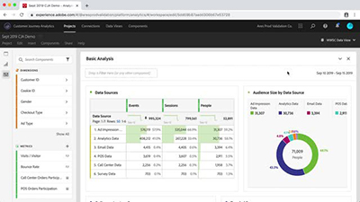

# Customer Journey Analytics självstudiekurser

Välkommen till webbplatsen för [!DNL Customer Journey Analytics] självstudiekurser.  Genom att använda dessa självstudiekurser tillsammans med [dokumentationen](https://experienceleague.adobe.com/docs/analytics-platform/using/cja-landing.html) får du en bättre förståelse för hur du använder Adobe Analytics för att få kundinsikter i flera kanaler snabbare än någonsin.  För att komma igång,

* Se avsnittet **&quot;Nyheter&quot;** nedan för de senaste funktionerna
* **Personalval** markerar en del av vårt favoritinnehåll
* Utforska innehållet efter ämne och underämne i **vänster navigering**
* Använd fältet **sök** längst upp på sidan om du vet vad du söker efter

Med Customer Journey Analytics kan ni styra hur ni kopplar samman era online- och offlinedata i Analysis Workspace med vilket gemensamt kund-ID som helst, så att ni till sist kan skapa attribuering, segmentering, flöde, utfall osv. i hela er kunddatauppsättning.

## Personalval

<table>
<tr>
  <td>
    
    

      <a href="visitor-id/understanding-how-customer-journey-analytics-uses-identity.md">
    <strong> Förstå hur Customer Journey Analytics använder identitet </strong>
    </a>
    

    

    <em>En praktisk titt på hur identitet påverkar din analys i Customer Journey Analytics</em>
    

  </td>
   <td>
    
    

      <a href="architecture/architecture-and-integrations-of-cja.md">
    <strong> Arkitektur och integrering av Customer Journey Analytics </strong>
    </a>
    

    

    <em>Genomgång av Customer Journey Analytics-arkitekturen, inklusive integrering med Adobe Experience Platform.</em>
    

  </td>
  <td>
    
    

      <a href="analysis-workspace/visualizations/cross-channel-attribution-in-customer-journey-analytics.md">
    <strong> Cross-Channel Attribution i Customer Journey Analytics </strong>
    </a>
    

    

    <em>Så här kan du använda visualiseringar för att visa attribuering (ge kredit) i olika kanaler.</em>
    

  </td>
</tr>
</table>

